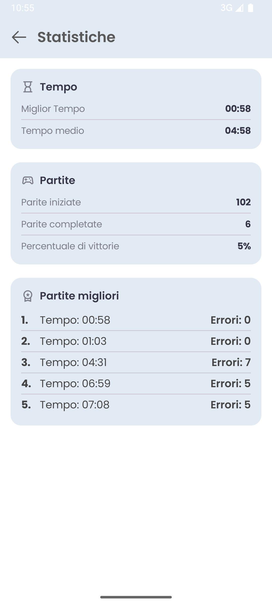
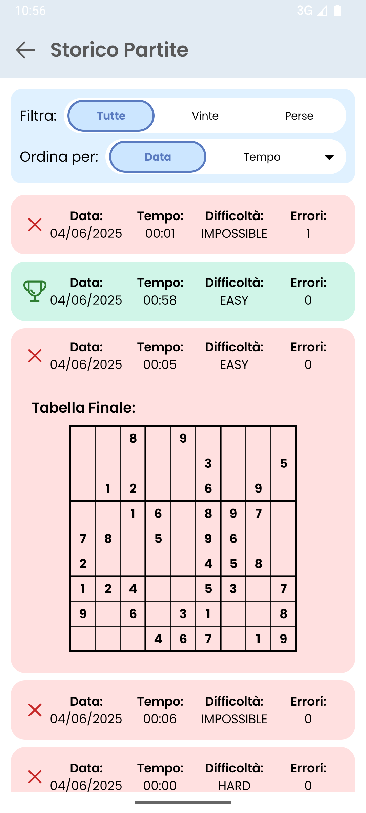
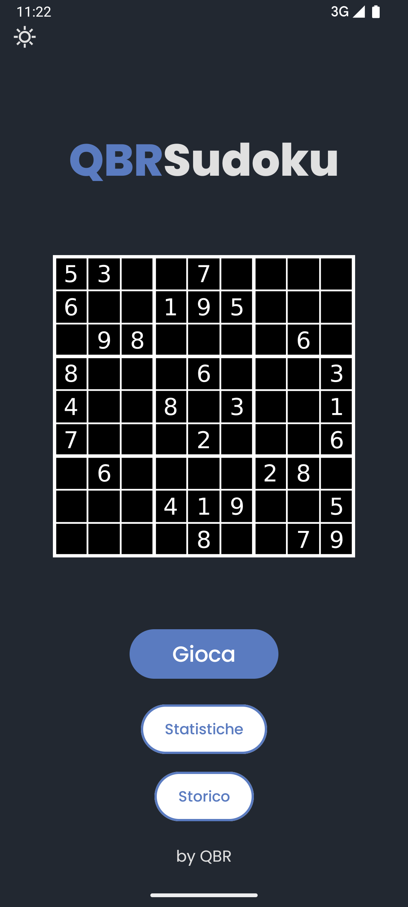
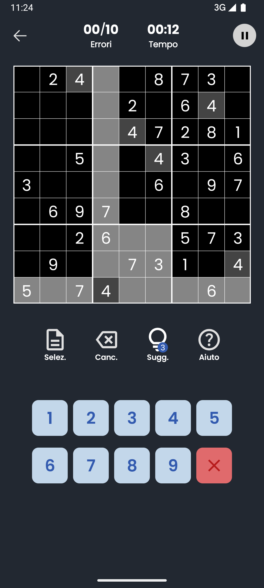
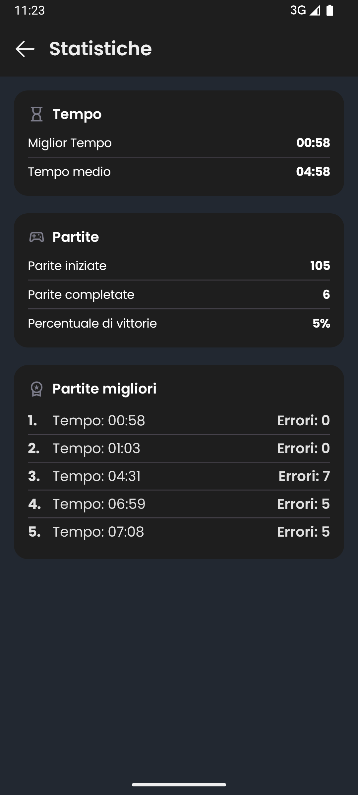
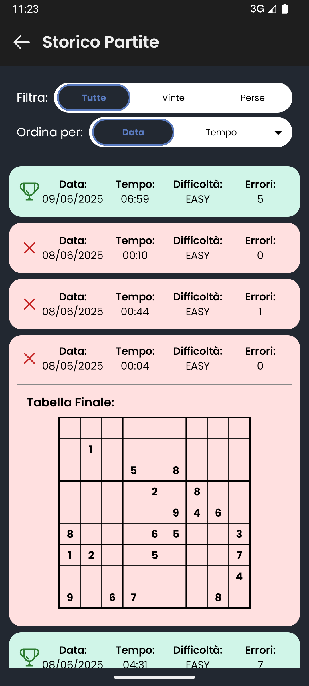
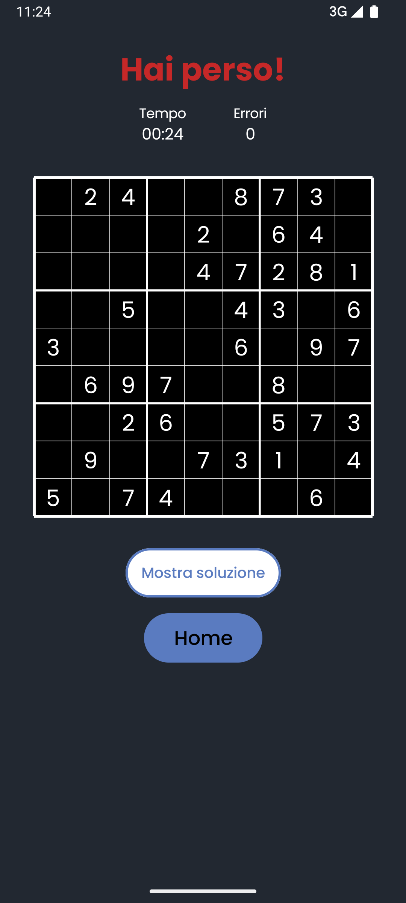

# QBRSudoku

QBRSudoku è un'applicazione Android per giocare a Sudoku, sviluppata in Kotlin con un'interfaccia moderna e funzionalità avanzate di tracciamento delle partite e statistiche.

## Funzionalità principali

- **Interfaccia semplice e intuitiva** per giocare a Sudoku.
- **Tracciamento degli errori** e del tempo di gioco.
- **Statistiche dettagliate** sulle partite svolte, tempi migliori e percentuale di vittorie.
- **Storico partite** con possibilità di filtrare e ordinare i risultati.
- **Suggerimenti, selezione e cancellazione rapida** per aiutare il giocatore durante la partita.


## Screenshot

|  |  |  |  |  |
|:---:|:---:|:---:|:---:|:---:|


---

|  |  |  |  |  |
|:---:|:---:|:---:|:---:|:---:|


## Come funziona

- Avvia l'app e scegli "Gioca" per iniziare una nuova partita di Sudoku.
- Inserisci i numeri toccando le caselle, usa i tasti di selezione rapida, cancella e suggerimenti se necessario.
- Gli errori e il tempo vengono tracciati automaticamente.
- Consulta la sezione "Statistiche" per vedere i tuoi record e i progressi.
- Nella sezione "Storico" puoi rivedere tutte le partite, filtrare per vinte/perse e ordinare per data o tempo.

## Installazione e sviluppo

1. **Clona il repository**
   ```sh
   git clone https://github.com/nich-bi/QBRSudoku.git
   ```
2. **Apri il progetto in Android Studio**
3. **Compila ed esegui** su un emulatore o dispositivo Android.

> **Requisiti**
> - Android Studio
> - Android SDK 23+
> - Kotlin

## Crediti

Sviluppato da:
[Nicolò Bianchi](https://github.com/nich-bi)
[David Belfiori](https://github.com/davidbelfiori)
[Matteo Volpe](https://github.com/Fox070204)


---

QBRSudoku è pensato per tutti gli amanti dei puzzle e della logica. Buon divertimento!
